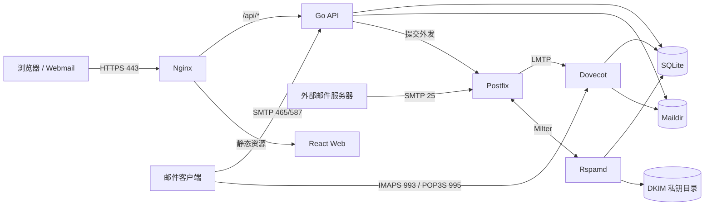

# imyemail 系统架构

本文描述当前代码与部署的真实边界。生产环境默认使用 all-in-one 镜像；拆分式 Compose 主要用于开发、调试和预发布验证。

## 总体结构



## 组件职责

| 组件 | 目录 | 职责 |
| --- | --- | --- |
| Web | `apps/web` | React 管理后台与 Webmail；只通过 HTTP API 访问后端 |
| Go API | `apps/api` | 身份认证、权限、业务 API、SQLite、发送队列、Maildir 索引、证书和 Webhook |
| Rust API | `apps/api-rs` | 渐进迁移代理入口；当前不替代 Go API，不作为生产权威数据源 |
| Manager | `apps/manager` | 安装、更新、备份、回滚、诊断与卸载；内嵌 Compose 和环境变量模板 |
| Gateway | `deploy/nginx` | TLS 入口、静态资源与 API 反向代理 |
| Postfix | `deploy/postfix` | SMTP 接收、路由、外发以及 Rspamd Milter 接入 |
| Dovecot | `deploy/dovecot` | IMAP、POP3、LMTP 和邮箱认证 |
| Rspamd | `deploy/rspamd` | 垃圾邮件检查和 DKIM 签名 |

## 部署模式

### All-in-one（生产默认）

`deploy/all-in-one/Dockerfile` 将 Go API、Web、Nginx、Postfix、Dovecot、Rspamd 和 Rsyslog 打包到 `ghcr.io/logdns/imyemail`。Supervisor 管理容器内进程，数据通过四个宿主机目录持久化：

```text
/opt/imyemail/data/   SQLite、附件、证书与备份
/opt/imyemail/mail/   Maildir 邮件原文
/opt/imyemail/dkim/   Rspamd DKIM 私钥
/opt/imyemail/rspamd-cache/ Rspamd 规则编译缓存
```

该模式由 `deploy/docker-compose.yml` 和 Rust Manager 使用，是安装器、在线更新与回滚的唯一生产默认路径。

### Split stack（开发与诊断）

`deploy/docker-compose.stack.yml` 将 API、Web、Gateway、Postfix、Dovecot 和 Rspamd 拆分。它便于观察单个服务日志和替换组件，但需要维护更多共享卷、证书与服务依赖。

`deploy/docker-compose.stack.rust.yml` 只用于验证 Rust 代理迁移路径；Go API 仍然负责权威业务逻辑和数据写入。

## 数据与一致性

- SQLite 默认路径是 `/data/imyemail.db`，启用 WAL、外键约束和单写连接。
- API 会把 SQLite 主文件及 WAL/SHM 设为仅 root 与 Postfix 共享组可读写（`0660`），避免 Postfix 地址查询因 WAL 权限不足而阻塞 SMTP。
- Maildir 是邮件原文存储，Go API 定期同步索引；SQLite 不是邮件原文的唯一备份。
- MIME 文本在传输编码解码后按声明的 charset 转换为 UTF-8；兼容 GB18030、GBK、GB2312 等常见中文邮件，并可在 Maildir 重扫时修复旧索引中的替换字符。
- 邮箱可覆盖账号权限组的单附件上限；值为 `0` 时继承账号限制，默认普通账号为 25 MB。立即发送、草稿和定时发送使用同一后端校验。
- SMTP Submission 同时支持 `AUTH PLAIN` 和兼容旧客户端的 `AUTH LOGIN`。SMTP 鉴权由 Go API 处理；IMAP/POP3 鉴权由 Dovecot SQL passdb 处理。
- Dovecot auth-policy report 与 Go Submission 将三种协议的成功/失败鉴权写入 `client_access_events`。记录按用户和邮箱隔离、保留 90 天，前台单次最多读取 100 条；不存储密码或认证载荷。

## 前端静态资源 CDN

正式版本的 CSS、JavaScript 分块通过版本固定的 `cdn.jsdelivr.net/gh/logdns/imyemail@vX.Y.Z/apps/web/dist/` 地址加载，并在 Git Tag 中保存与镜像完全一致的静态快照。入口 HTML、API、邮件内容和账号数据仍只由自建服务器提供；CDN 不承载任何用户数据。CDN 入口加载失败时会自动回退到容器内 `/assets/`，Nginx 同时启用 gzip 和长期不可变缓存。
- 附件、证书、邮件、DKIM 私钥和 `.env` 不包含在单独的 SQLite 在线备份中，灾难恢复必须整体备份持久化目录。
- Manager 更新前保存 SQLite 在线备份、当前镜像引用和 Compose 回滚点；镜像回滚不会回滚数据库内容。

## 安全边界

- 浏览器会话、API Token 和管理员权限均由 Go API 强制校验，前端隐藏按钮不构成授权边界。
- TOTP 使用标准 `otpauth://` URI，可由常见验证器扫码；登录挑战最多允许 5 次验证码尝试。有限时间漂移、一次性恢复码和管理员重置用于避免设备或时间故障造成永久锁定。
- 2FA 启用后，Dovecot 与 SMTP Submission 只接受按邮箱生成的 bcrypt 应用密码；网页登录仍要求账号密码与第二因素。关闭或重置 2FA 会撤销应用密码。
- 全域公告由管理员权限保护，数据库只允许一个当前活动公告；前台按纯文本展示，用户关闭状态只保存在本地浏览器。
- 更新服务只在 Compose 内部网络开放，并使用独立随机令牌；Docker Socket 只挂载给更新服务。
- SMTP、IMAP、POP3 与 Web 共用托管证书；首次启动的自签证书只用于引导。
- 客户端连接记录只保存协议、来源 IP、有限长度客户端标识、鉴权机制、结果和时间；API 按当前登录用户与邮箱归属再次校验。
- 外部 IMAP、状态 Webhook、DNS/SMTP 检测默认拒绝不安全的私网目标，降低 SSRF 风险。
- `.env`、SQLite、证书私钥、DKIM 私钥和备份均不得提交到仓库或写入公开日志。

## 镜像与发布

正式发布由 `vX.Y.Z` 标签触发 `.github/workflows/docker.yml`：

1. 运行 Web、Go、Rust 和脚本检查。
2. 为 amd64/arm64 构建静态 Manager，并生成 SHA-256 文件。
3. 构建并推送 all-in-one 及拆分组件镜像到 GHCR。
4. 校验远端镜像清单，再创建 GitHub Release 并上传 Manager 附件。

主镜像支持 `linux/amd64` 与 `linux/arm64`。拆分式 Postfix、Dovecot 和 Rspamd 镜像当前仅发布 `linux/amd64`；这不影响默认 all-in-one 的双架构支持。

## 请求与邮件流

### Web 请求

```text
Browser -> Nginx -> /api/* -> Go API -> SQLite / Maildir
                 -> /*     -> React static files
```

### 入站邮件

```text
Remote MTA -> Postfix -> Rspamd -> Dovecot LMTP -> Maildir -> Go API index
```

### 外发邮件

```text
Web/API/SMTP Submission -> Go API queue -> Postfix or configured relay -> Remote MTA
```

Postfix 连接 Rspamd 使用短超时并以 `accept` 方式降级：过滤器重启或首次编译规则时，邮件不会长期卡死；Rspamd 恢复后继续进行垃圾邮件检查和 DKIM 签名。

## 代码变更边界

- 修改数据库表、身份认证、权限或发送队列时，应同时更新 Go 测试与 API 文档。
- 修改容器端口、卷或环境变量时，应同步更新 `.env.example`、Compose、Manager 内嵌资产和部署文档。
- 修改正式镜像集合或架构时，应同步更新 Docker Release 工作流和 Release Notes 表格。
- Rust 迁移只有在行为、鉴权、持久化和回滚能力与 Go API 对齐后，才能进入默认生产路径。
